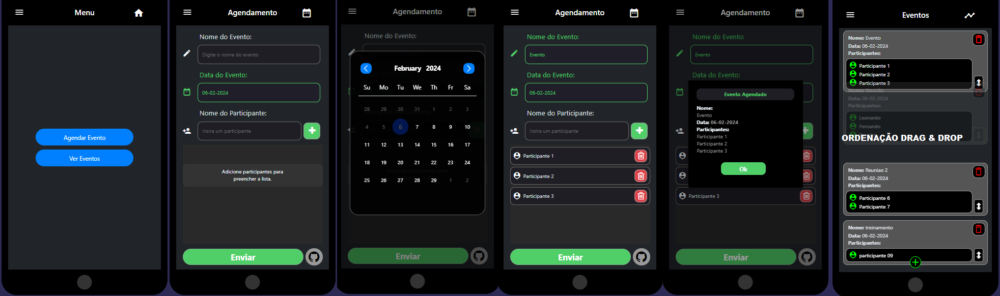

Este é um projeto realizado para praticar conceitos de mobile com o React Native EXPO.
nele é realizado um CRUD numa agenda de eventos com drag & drop

# Como Iniciar : 

>**Nota**: Certifique-se de ter concluído as instruções da configuração do ambiente na documentação do [React Native - Environment Setup](https://reactnative.dev/docs/environment-setup)

## Passo 1: 

```bash
# usando npm
npm install
npm start


# Ou usando Yarn
yarn add
yarn start
```

## Step 2: Iniciando o Aplicativo

### Para Android

```bash
# usando npm
npm run android

# Ou usando Yarn
yarn android
```

### Para iOS

```bash
# usando npm
npm run ios

# Ou usando Yarn
yarn ios
```

Se tudo estiver configurado _corretamente_, você deverá ver seu novo aplicativo em execução em seu _Android Emulator_ ou _iOS Simulator_ em breve, desde que tenha configurado seu emulador/simulador corretamente.

# Foto do app: 
 
